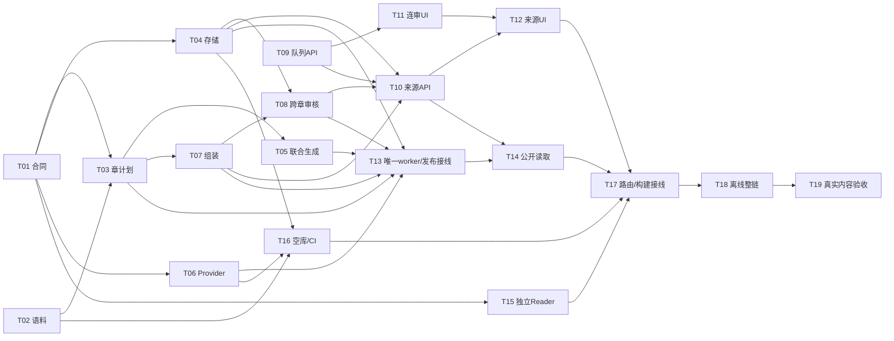

# Chronicle 第一轮：章节生产、合并审核与完整译文

父协调 Issue：[#548](https://github.com/6spot/Loom/issues/548)，上层讨论 [#547](https://github.com/6spot/Loom/issues/547)。本轮 **19 个执行叶，2 个完成（T01、T02 已对账）**。#548 仅协调；后两轮 #549/#550 不在此图中。

本轮结果是完整自然章 → 联合翻译/提取 → 有原文上下文的关联审核 → 已发布完整白话 → 按需原文。19 项是把同一结果拆成有界交付，不是增加19个产品方向。

## 已固定的合同

- [chapter-production.md](../../../../apps/chronicle/docs/chapter-production.md)：受控 txt 单章/md 自然章、完整上下文一次生成+最多一次整章修正、联合产物、精确来源、来源内 Resolution0.2、原子发布及 Reader API。
- [review-workflow.md](../../../../apps/chronicle/docs/review-workflow.md)：现有 /studio/jobs/reviews 路由、scope/keyset、草稿/跳过/队尾、两侧和逐组来源。
- 实施仍遵守 Architecture Index、Amendment0006/0007 与当前开发/完成流程；不是让执行模型自行决定身份权限。
- 全新开发测试数据；不用迁移旧产物/UUID或双轨。旧C0/C1历史和#541发现不由本计划自动宣称修复。

## 任务与依赖

表中 Txx 均指 C2-R1-Txx。每个 Issue 有输入/输出、明确文件、步骤、验收、检查和交付边界；任务文件只保存状态与证据，不复制规范。

| Task | GitHub | Status | Depends on | 交付 |
| --- | --- | --- | --- | --- |
| [T01](T01-chapter-contract.md) | [#551](https://github.com/6spot/Loom/issues/551) | completed | — | 章节联合产物 schema、原文锚点与校验器 |
| [T02](T02-acceptance-corpus.md) | [#552](https://github.com/6spot/Loom/issues/552) | completed | — | 冻结两部著作、四个完整自然章及内容核对点 |
| [T03](T03-chapter-planning.md) | [#553](https://github.com/6spot/Loom/issues/553) | in_progress | T01, T02 | 自然章规划与规范化原文 block manifest |
| [T04](T04-chapter-store.md) | [#554](https://github.com/6spot/Loom/issues/554) | planned | T01 | 章产物存储、租约写入与发布记录表 |
| [T05](T05-chapter-extraction.md) | [#555](https://github.com/6spot/Loom/issues/555) | planned | T01, T03 | 完整章联合翻译与提取、完整上下文修正 |
| [T06](T06-chapter-provider.md) | [#556](https://github.com/6spot/Loom/issues/556) | planned | T01 | 真实模型与fixture适配新的联合输出协议 |
| [T07](T07-chapter-assembly.md) | [#557](https://github.com/6spot/Loom/issues/557) | planned | T01, T03 | 章产物组装、统一ref映射与来源provenance |
| [T08](T08-chapter-resolution.md) | [#558](https://github.com/6spot/Loom/issues/558) | planned | T04, T07 | 同书跨章候选、混合审核计划与发布器版本适配 |
| [T09](T09-review-queue-api.md) | [#559](https://github.com/6spot/Loom/issues/559) | planned | — | 审核队列范围、稳定分页及全部页消费者 |
| [T10](T10-review-source-api.md) | [#560](https://github.com/6spot/Loom/issues/560) | planned | T04, T07, T08, T09 | 审核双方来源上下文、精确原文与整章查询 |
| [T11](T11-continuous-review-ui.md) | [#561](https://github.com/6spot/Loom/issues/561) | planned | T09 | 保存并下一项、暂时跳过、草稿和队列位置恢复 |
| [T12](T12-review-evidence-ui.md) | [#562](https://github.com/6spot/Loom/issues/562) | planned | T10, T11 | 审核证据展开、逐组来源与整章阅读界面 |
| [T13](T13-chapter-worker-publication.md) | [#563](https://github.com/6spot/Loom/issues/563) | planned | T03, T04, T05, T06, T07, T08 | 唯一worker接线、章级恢复与原子公开发布 |
| [T14](T14-chapter-public-api.md) | [#564](https://github.com/6spot/Loom/issues/564) | planned | T10, T13 | 公开章节目录、完整译文与版本固定的原文API |
| [T15](T15-chapter-reader-components.md) | [#565](https://github.com/6spot/Loom/issues/565) | planned | T01 | 完整白话阅读、篇章目录与按需引用组件 |
| [T16](T16-fresh-environment-ci.md) | [#566](https://github.com/6spot/Loom/issues/566) | planned | T02, T04, T06 | 空语料初始化、配置与第一轮CI路径覆盖 |
| [T17](T17-reader-route-integration.md) | [#567](https://github.com/6spot/Loom/issues/567) | planned | T12, T14, T15, T16 | 篇章阅读接入公开导航、Rust路由与构建资源 |
| [T18](T18-offline-end-to-end-gate.md) | [#568](https://github.com/6spot/Loom/issues/568) | planned | T17 | 离线全链验收脚本、故障场景与CI接入 |
| [T19](T19-live-content-acceptance.md) | [#569](https://github.com/6spot/Loom/issues/569) | planned | T18 | 真实模型、逐章内容核对与第一轮最终验收 |

## 可并行部分与串行接线

不要求为每个叶另开分支。并行资格同时满足：依赖在默认分支 completed；当前写入文件互不重叠；共享命令/入口有明确负责人。不能只因逻辑看似独立就同时修改同一文件。



建议领取顺序按依赖动态推进，不必等待同一行全部结束才开启无关工作：

| 时机 | 可并行的工作示例 | 需等候的接线 |
| --- | --- | --- |
| 规划到默认分支 | T01、T02、T09 | 暂不开始依赖叶 |
| T01后 | T04、T06、T15；T02也完成则T03 | 共享模型字段已冻结 |
| T03后、T09后 | T05、T07、T11 | T05/T07不同文件，审核UI独立 |
| T04/T07后 | T08；模型/provider工作可继续 | 不并改resolve/review helpers |
| T08等依赖后 | T10、T13；符合条件可跑T16 | 后端来源/唯一worker/部署文件分别归属 |
| T10/T11后、T13后 | T12与T14；T15可早已完成 | 审核页只由T12接T11成果 |
| 其余完成 | T17 → T18 → T19 | 最后导航构建、离线、真实内容依次验收 |

## 共享文件的顺序所有权

路径以下均在 apps/chronicle 内，根级文件写全路径。新模块、对应测试与Issue列出的文档由各叶独占。

| 文件/资源 | 修改顺序或唯一owner |
| --- | --- |
| 新schema、chapter_contract.py、c2r1-contract fixtures | T01；后续消费，不各自重新定义 |
| corpus/first-round、source_pack.py | T02；验收报告由T19追加 |
| migrations/0006_chronicle_chapters.sql、control_plane.py | T04唯一owner；不另开并行migration编号 |
| chapter_store.py | T04 → T13 |
| chapter_extraction.py/chapter_prompt.py | T05 |
| model_provider.py/extraction_model_schema.py/fixture_model.py | T06 |
| assembly.py | T07 |
| resolution_v0.py/review_subjects.py/resolution_store.py及publisher版本门 | T08 |
| resolve_publish.py | T08 → T13 |
| ingestion_worker.py/production_worker.py/canonical_store.py及read_api/coverage.py最新catalog接线 | T13唯一owner |
| read_api/studio_reviews.py | T09 → T10 |
| read_api/server.py | T10 → T14（公共source reader目录注入） |
| read_api/source_context.py | T10 → T14 |
| read_api/router.py/reader_chapters.py | T14 |
| webapp/src/lib/studio-api.ts | T09 → T11 → T12 |
| 两个审核页、review-flow-smoke、审核样式 | T11 → T12 |
| server/src/static_assets.rs、web/dist | T09 → T11 → T12 → T17；每次交付都包含本次必要构建/资源注册 |
| Reader专属新组件/client/CSS/harness | T15；不挂接App，不改全局样式或dist |
| App.tsx、lib/routes.ts、server/src/app.rs | T17 |
| Compose/env/chronicle_persist.py/部署说明 | T16 |
| .github/workflows/chronicle*.yml | T16 → T18 |
| .github/workflows/ci.yml的本轮ledger routing | T16 |
| 本README/Issue父索引、合并后对账 | 协调者串行汇总，各开发者只独立编辑自己的task记录 |

`npm ci/install`、构建提交产物、git checkout/reset/rebase、提交/推送及共享索引更新不能由多个工作者同时操作。T15可以并行编写独立模块；它的build验证也预约无其他dist写入的窗口。**不允许UI叶缺少匹配dist就先完成，再依赖后续集成补齐。**

若实际实现需要触碰别人的文件，先交接该文件或调整为串行；不要为维持“并行”人为拆成互相冲突的修改。任何变更不得自行扩展到第二/三轮。

## 派给Luna的方式

当前可领取的叶只有 [T01/#551](https://github.com/6spot/Loom/issues/551)、[T02/#552](https://github.com/6spot/Loom/issues/552)、[T09/#559](https://github.com/6spot/Loom/issues/559)（以前置记录已在默认分支为准），均尚未开始。

一次只分配一个叶：

```text
实现 <Issue URL> 对应的 C2-R1-Txx。
先读根AGENTS.md、当前开发/Task Ledger指南、本轮README、该task与Issue，
再读任务引用的章节/审核合同和现有代码测试。
仅在所有depends_on已于默认分支完成对账后开工。
使用Issue规定的输入输出、文件范围、步骤和验收；不要自行设计新身份/发布语义。
并行开发只写分配给本任务的文件；共享文件与构建交接后再操作。
完成所需检查并记录真实证据；按task-completion做交付和合并后对账。
遇到超范围/合同冲突，报告具体冲突，保留其他独立可做的进展。
```

多数纯模块和UI叶可交Luna。T08身份图、T13租约/原子发布应独立复核；T19的内容结论由人工或独立较强复核者核对，不让开发者仅凭自己的测试宣布译文准确。

## 状态与验证

每个task按 [task-completion](../../../development/task-completion.md) 完成。交付PR合并不等于完成：实际completion_pr/merge_sha、验收勾选和CI证据以及索引一致性必须到默认分支，再关闭Issue和激活依赖。

当前这里只交付规划文档与GitHub任务，未运行新产品测试或模型。规划校验命令：

```bash
python3 tools/validator_ready.py --root docs/tasks/chronicle/first-round --check --format json
python3 tools/check_architecture.py
python3 tools/check_storage_sql_ownership.py
git diff --check
```

实施测试按各Issue和当前canonical开发指南执行。数据库测试沿用PG18控制服务和隔离库；新界面必须实际操作，不用源码字符串测试代替。T16补本轮CI路由，T18补离线整链，T19才执行真实provider/内容验收。

规划核对（2026-09-08）：Task Ledger validator通过（20条记录，3项可领取，无违规）；19叶依赖无循环，最终门覆盖其他18项；状态/验收/索引一致，115个本地文档链接有效；SQL ownership和diff whitespace检查通过。Architecture checker在读取Cargo metadata前因本机缺少cargo退出，未宣称通过；本次未改实现代码、SQL或Cargo依赖。GitHub父子关系和正文在发布时回读核验。
