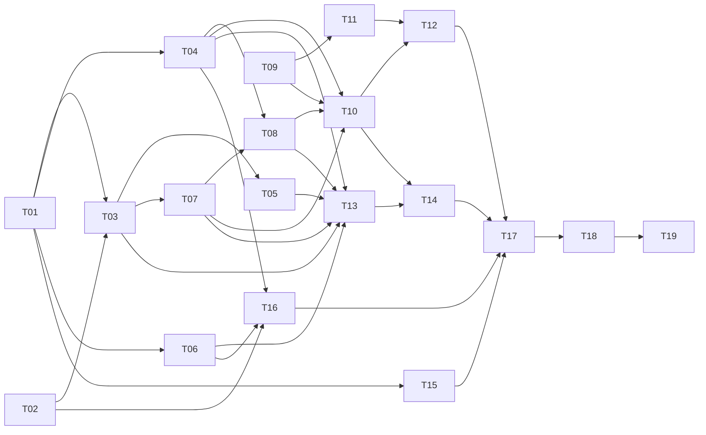

# Chronicle 第一轮：章节生产、合并审核与完整译文

父协调 Issue：[#548](https://github.com/6spot/Loom/issues/548)，上层讨论 [#547](https://github.com/6spot/Loom/issues/547)。本轮把完整自然章 → 联合翻译/提取 → 有原文上下文的关联审核 → 已发布完整白话 → 按需原文拆成 19 个有界交付。

## 已固定的合同

- [chapter-production.md](../../../../apps/chronicle/docs/chapter-production.md)：受控 txt 单章/md 自然章、完整上下文一次生成+最多一次整章修正、联合产物、精确来源、来源内 Resolution 0.2、原子发布及 Reader API。
- [review-workflow.md](../../../../apps/chronicle/docs/review-workflow.md)：现有 `/studio/jobs/reviews` 路由、scope/keyset、草稿/跳过/队尾、两侧和逐组来源。
- 实施遵守 Architecture Index、Amendment 0006/0007 与当前开发流程；执行任务不得自行决定新的身份/发布语义。
- 全新开发测试数据；不用迁移旧产物/UUID或双轨。旧 C0/C1 历史和 #541 发现不由本计划自动宣称修复。

## 任务图

表中的依赖描述设计顺序和接口前置。

| Task | GitHub | Depends on | 交付 |
| --- | --- | --- | --- |
| [T01](T01-chapter-contract.md) | [#551](https://github.com/6spot/Loom/issues/551) | — | 章节联合产物 schema、原文锚点与校验器 |
| [T02](T02-acceptance-corpus.md) | [#552](https://github.com/6spot/Loom/issues/552) | — | 冻结两部著作、四个完整自然章及内容核对点 |
| [T03](T03-chapter-planning.md) | [#553](https://github.com/6spot/Loom/issues/553) | T01, T02 | 自然章规划与规范化原文 block manifest |
| [T04](T04-chapter-store.md) | [#554](https://github.com/6spot/Loom/issues/554) | T01 | 章产物存储、租约写入与发布记录表 |
| [T05](T05-chapter-extraction.md) | [#555](https://github.com/6spot/Loom/issues/555) | T01, T03 | 完整章联合翻译与提取、完整上下文修正 |
| [T06](T06-chapter-provider.md) | [#556](https://github.com/6spot/Loom/issues/556) | T01 | 真实模型与 fixture 适配新的联合输出协议 |
| [T07](T07-chapter-assembly.md) | [#557](https://github.com/6spot/Loom/issues/557) | T01, T03 | 章产物组装、统一 ref 映射与来源 provenance |
| [T08](T08-chapter-resolution.md) | [#558](https://github.com/6spot/Loom/issues/558) | T04, T07 | 同书跨章候选、混合审核计划与发布器版本适配 |
| [T09](T09-review-queue-api.md) | [#559](https://github.com/6spot/Loom/issues/559) | — | 审核队列范围、稳定分页及全部页消费者 |
| [T10](T10-review-source-api.md) | [#560](https://github.com/6spot/Loom/issues/560) | T04, T07, T08, T09 | 审核双方来源上下文、精确原文与整章查询 |
| [T11](T11-continuous-review-ui.md) | [#561](https://github.com/6spot/Loom/issues/561) | T09 | 保存并下一项、暂时跳过、草稿和队列位置恢复 |
| [T12](T12-review-evidence-ui.md) | [#562](https://github.com/6spot/Loom/issues/562) | T10, T11 | 审核证据展开、逐组来源与整章阅读界面 |
| [T13](T13-chapter-worker-publication.md) | [#563](https://github.com/6spot/Loom/issues/563) | T03, T04, T05, T06, T07, T08 | 唯一 worker 接线、章级恢复与原子公开发布 |
| [T14](T14-chapter-public-api.md) | [#564](https://github.com/6spot/Loom/issues/564) | T10, T13 | 公开章节目录、完整译文与版本固定的原文 API |
| [T15](T15-chapter-reader-components.md) | [#565](https://github.com/6spot/Loom/issues/565) | T01 | 完整白话阅读、篇章目录与按需引用组件 |
| [T16](T16-fresh-environment-ci.md) | [#566](https://github.com/6spot/Loom/issues/566) | T02, T04, T06 | 空语料初始化、配置与第一轮 CI 路径覆盖 |
| [T17](T17-reader-route-integration.md) | [#567](https://github.com/6spot/Loom/issues/567) | T12, T14, T15, T16 | 篇章阅读接入公开导航、Rust 路由与构建资源 |
| [T18](T18-offline-end-to-end-gate.md) | [#568](https://github.com/6spot/Loom/issues/568) | T17 | 离线全链验收脚本、故障场景与 CI 接入 |
| [T19](T19-live-content-acceptance.md) | [#569](https://github.com/6spot/Loom/issues/569) | T18 | 真实模型、逐章内容核对与第一轮最终验收 |

## 共享文件所有权

并行实现同时遵守任务依赖和真实文件所有权，避免多个任务同时修改同一共享入口。

| 文件/资源 | 修改顺序或唯一 owner |
| --- | --- |
| 新 schema、`chapter_contract.py`、c2r1-contract fixtures | T01；后续消费，不各自重新定义 |
| corpus/first-round、`source_pack.py` | T02；验收报告由 T19 追加 |
| `migrations/0006_chronicle_chapters.sql`、`control_plane.py` | T04 唯一 owner；不另开并行 migration 编号 |
| `chapter_store.py` | T04 → T13 |
| `chapter_extraction.py` / `chapter_prompt.py` | T05 |
| `model_provider.py` / `extraction_model_schema.py` / `fixture_model.py` | T06 |
| `assembly.py` | T07 |
| `resolution_v0.py` / `review_subjects.py` / `resolution_store.py` 及 publisher 版本门 | T08 |
| `resolve_publish.py` | T08 → T13 |
| `ingestion_worker.py` / `production_worker.py` / `canonical_store.py` 及最新 catalog 接线 | T13 唯一 owner |
| `read_api/studio_reviews.py` | T09 → T10 |
| `read_api/server.py` | T10 → T14 |
| `read_api/source_context.py` | T10 → T14 |
| `read_api/router.py` / `reader_chapters.py` | T14 |
| `webapp/src/lib/studio-api.ts` | T09 → T11 → T12 |
| 审核页、review-flow-smoke、审核样式 | T11 → T12 |
| `server/src/static_assets.rs`、`web/dist` | T09 → T11 → T12 → T17 |
| Reader 专属新组件/client/CSS/harness | T15；不挂接 App，不改全局样式或 dist |
| `App.tsx`、`lib/routes.ts`、`server/src/app.rs` | T17 |
| Compose/env/`chronicle_persist.py`/部署说明 | T16 |
| `.github/workflows/chronicle*.yml` | T16 → T18 |
| `.github/workflows/ci.yml` 的本轮 routing | T16 |

如果实现需要触碰别人的当前所有权文件，先协调交接或串行，不要为了维持并行而制造重复入口。

## 交付

每个 Leaf 以自己的 Issue、代码、验证和 PR 交付。任务文档按需要记录有价值的范围、设计说明和验证证据。

仓库交付完成规则见 [`../../../development/task-completion.md`](../../../development/task-completion.md)。
