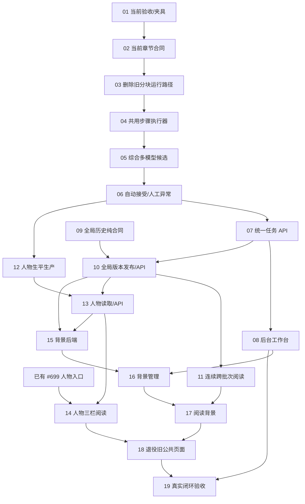

# Chronicle 产品收敛与补齐

GitHub 父任务：[#709](https://github.com/6spot/Loom/issues/709)。下表同时链接本地任务详情和 GitHub 子任务。

本轮接续现有 R2/R3 与分阶段生产，目标是一个可持续扩展的 Chronicle：
完整资料经过分步骤、多模型核对，形成连续正序历史；人物与地点状态随阅读
变化；人物有独立生平；背景由人工上传、核验并保存后出现。

父任务负责范围协调与最终验收，具体开发交给下面的叶任务。
这里记录需求、实现边界和验收，任务状态交由现用管理工具。没有默认分支
Task Ledger PR/merge 对账要求。既不规定多个分支，也不把并行理解为同时改
共享文件：代码可以在同一分支按文件归属推进，有前置的接线按下面顺序进行。

## 本次先清理的范围

已确认的重复前端、闲置页面/路由解析器、外部 `/v0` 别名、Python 静态页面、
重复生产 CLI 和旧部署模型开关在本次清理中退役。有效的身份候选与 catalog
算法移到正式 persistence 模块；详细判断及验证见 [清理记录](cleanup.md)。

仍被当前代码引用的旧 schema 定义、C1 测试路径和活跃旧页面不能按名字乱删。
T01–T03、T18 将在当前替代能力与对应验证接好后删除它们。这个顺序处理真实
依赖，不要求兼容旧测试数据、旧生产协议或旧 URL。有效引用/身份/租约/原子
发布的约束不因开发阶段清理而丢弃。

## 产品依据

- [产品定义](../../../../apps/chronicle/docs/product.md)：正文主线、现状与未完成能力。
- [主历史页面](../../../../apps/chronicle/docs/historical-narrative-design.md)：锚点是定位、精选重点、三栏职责、深层依据。
- [分阶段章节生产](../../../../apps/chronicle/docs/staged-chapter-production.md)：逐步保存、可配置模型、比较/复核、有限纠错。
- [多史料核对](../../../../apps/chronicle/docs/source-corroboration.md)：来源关系、结论、阶段、接受和发布。
- [人物状态](../../../../apps/chronicle/docs/person-state-reading.md)与[背景规则](../../../../apps/chronicle/docs/background-art.md)。
- 应用存储、身份决定边界分别遵守已接受的 Amendment 0006/0007。应用内常规实现不自动触发新的 Loom Amendment；确有引擎语义/权限变化才走该流程。

T09、T12、T15 各自把新能力的准确字段、错误与边界写入指定应用规范，再由
后续叶消费；任务说明不成为第二份长期接口权威。

## 可以先交给 Luna 的第一批

1. [已有 #699 人物入口修复](T00-entity-entry.md)：立即改善真实人物页，无需等全局历史。
2. [T01 / #710 当前生产验收与夹具](T01.md)：为彻底删旧生产分支准备正确回归。
3. [T09 / #718 全局历史合同与纯编排](T09.md)：独立于前两项，可并行完成。

先按各自标准验收这三项，不把整个后续规划塞进同一轮验收。

## 子任务索引

<!-- task-table:start -->
| 任务详情 | GitHub | 内容 | 前置 |
| --- | --- | --- | --- |
| [T00](T00-entity-entry.md) | [#699](https://github.com/6spot/Loom/issues/699) | 真实人物入口与当前状态 | 无 |
| [C3-T01](T01.md) | [#710](https://github.com/6spot/Loom/issues/710) | 用当前分阶段合同统一来源生产验收与测试夹具 | 无 |
| [C3-T02](T02.md) | [#711](https://github.com/6spot/Loom/issues/711) | 收敛章节 schema、校验与装配为当前 0.4 合同 | [#710](https://github.com/6spot/Loom/issues/710) |
| [C3-T03](T03.md) | [#712](https://github.com/6spot/Loom/issues/712) | 删除 C1 分块生产、重复 presentation 与旧运行器分支 | [#711](https://github.com/6spot/Loom/issues/711) |
| [C3-T04](T04.md) | [#713](https://github.com/6spot/Loom/issues/713) | 把已验证的分步骤执行机制提取为可复用组件 | [#712](https://github.com/6spot/Loom/issues/712) |
| [C3-T05](T05.md) | [#714](https://github.com/6spot/Loom/issues/714) | 让综合事实和历史正文支持逐步多模型候选与对比 | [#713](https://github.com/6spot/Loom/issues/713) |
| [C3-T06](T06.md) | [#715](https://github.com/6spot/Loom/issues/715) | 实现可审计的自动内容通过与人工异常分流 | [#714](https://github.com/6spot/Loom/issues/714) |
| [C3-T07](T07.md) | [#716](https://github.com/6spot/Loom/issues/716) | 为所有生产任务提供统一且可读的步骤与结果 API | [#715](https://github.com/6spot/Loom/issues/715) |
| [C3-T08](T08.md) | [#717](https://github.com/6spot/Loom/issues/717) | 统一后台上传、任务进度、模型对比与异常审核页面 | [#716](https://github.com/6spot/Loom/issues/716) |
| [C3-T09](T09.md) | [#718](https://github.com/6spot/Loom/issues/718) | 定义全局历史版本并实现跨批次编排的纯合同 | 无 |
| [C3-T10](T10.md) | [#719](https://github.com/6spot/Loom/issues/719) | 持久化全局历史版本并切换唯一公开读取入口 | [#716](https://github.com/6spot/Loom/issues/716)、[#718](https://github.com/6spot/Loom/issues/718) |
| [C3-T11](T11.md) | [#720](https://github.com/6spot/Loom/issues/720) | 让主历史阅读无缝跨越多个生产片段 | [#719](https://github.com/6spot/Loom/issues/719) |
| [C3-T12](T12.md) | [#721](https://github.com/6spot/Loom/issues/721) | 生产独立的、有依据的人物生平叙事 | [#715](https://github.com/6spot/Loom/issues/715) |
| [C3-T13](T13.md) | [#722](https://github.com/6spot/Loom/issues/722) | 提供人物生平分页与主历史阶段对应的读取 API | [#719](https://github.com/6spot/Loom/issues/719)、[#721](https://github.com/6spot/Loom/issues/721) |
| [C3-T14](T14.md) | [#723](https://github.com/6spot/Loom/issues/723) | 替换人物详情为概况、个人经历与当时状态三栏阅读 | [#722](https://github.com/6spot/Loom/issues/722)、[#699](https://github.com/6spot/Loom/issues/699) |
| [C3-T15](T15.md) | [#724](https://github.com/6spot/Loom/issues/724) | 建立背景素材上传、保存关联与受控读取后端 | [#719](https://github.com/6spot/Loom/issues/719)、[#722](https://github.com/6spot/Loom/issues/722) |
| [C3-T16](T16.md) | [#725](https://github.com/6spot/Loom/issues/725) | 实现 Studio 素材库、正文背景预览与人工保存 | [#717](https://github.com/6spot/Loom/issues/717)、[#724](https://github.com/6spot/Loom/issues/724) |
| [C3-T17](T17.md) | [#726](https://github.com/6spot/Loom/issues/726) | 阅读背景随正文位置自然切换且不干扰连续阅读 | [#720](https://github.com/6spot/Loom/issues/720)、[#725](https://github.com/6spot/Loom/issues/725) |
| [C3-T18](T18.md) | [#727](https://github.com/6spot/Loom/issues/727) | 收敛旧公共导航和百科式页面，删除被替换的实现 | [#723](https://github.com/6spot/Loom/issues/723)、[#726](https://github.com/6spot/Loom/issues/726) |
| [C3-T19](T19.md) | [#728](https://github.com/6spot/Loom/issues/728) | 用真实资料验收当前 Chronicle 产品闭环 | [#717](https://github.com/6spot/Loom/issues/717)、[#727](https://github.com/6spot/Loom/issues/727) |
<!-- task-table:end -->

## 依赖与可并行关系

- T06 后，T07 与 T12 是独立模块；T07 后的 T08 可与 T10 并行。
- T10 后，T11 的前端窗口与 T13 的人物读取可以并行（T13 还要等 T12）。
- T13 后，T14 人物页面和 T15 背景后端可并行。
- 其余按依赖接线。API/类型尚未交付时，可以准备明确的测试场景，不猜字段开发第二套协议。

| 共享文件/边界 | 修改顺序 |
| --- | --- |
| 章节协议、夹具、旧 worker 分支 | T01 → T02 → T03 → T04 |
| 综合生产与接受 | T05 → T06 → T07；T10 随后使用其保存/接受边界 |
| read_api/router、Studio jobs、Rust 路由 | T07 → T10 → T13 → T15 |
| Studio API client / Imports / Review / Layout | T08 → T16 |
| EntityPage | #699 → T14 → T18 |
| HistoryPage、主导航与旧页面退役 | T11 → T17 → T18 |

文件归属是防冲突边界；若发现某叶必须修改别人的共享文件，先调整执行顺序
或把接线交给指定所有者，不复制功能，也不靠之后合并冲突解决。

## 每个叶的交付规则

每个任务都写了当前问题、文件、实施步骤、反例和验收。开始前核对当前代码
与前置交付的真实接口，不能只看 Issue 是否关闭。完成后提交代码与适用的
验证证据；不创建仅补抄 PR/merge 元数据的后续提交。

验收区分程序机制与历史内容质量。fixture 可以证明位置、重试、事务和 API；
真实资料才能检验表述、来源归属和状态时点。公共页面的正式验收需要实际 API
和浏览器，不以静态图或单独 demo 代替。相同代码/配置/样本的成功结果可复用；
修复或新发现影响了行为才补跑对应检查，不在每一叶机械重复全部模型调用。

当前明确保留的规则：全局模型超时、整章白话译文与独立提取、首期简体、每步
结果留存、单条明确/存疑、来源与身份边界、深层依据、人工保存背景、锚点不
筛选正文。地图、问答、模拟、标题 slug 与手机时间轴重设计不顺带加入本轮。
