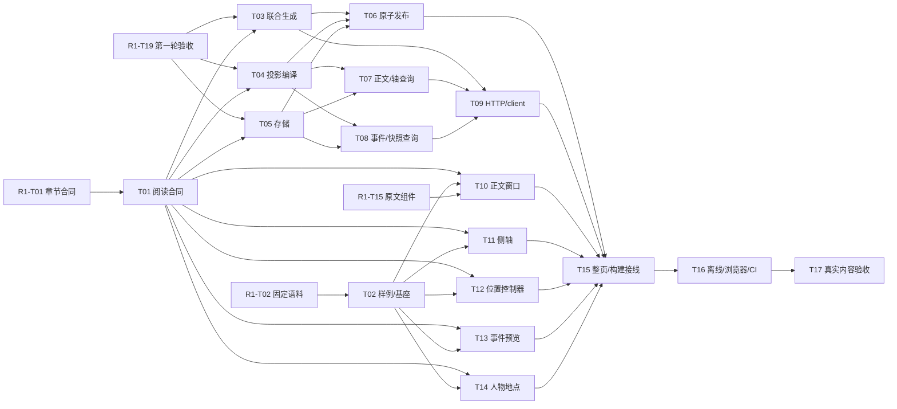

# Chronicle 第二轮：连续历史阅读、侧边时间轴与事件导航

父协调 Issue [#549](https://github.com/6spot/Loom/issues/549)，总讨论 [#547](https://github.com/6spot/Loom/issues/547)。本轮 **17 个执行叶，0 个完成，尚未开始实现**；不是一个可整体派给模型的大编码任务。第一轮 [#548](https://github.com/6spot/Loom/issues/548) 与 [台账](../first-round/README.md) 独立验收，第三轮 #550 仍为阶段规划。

## 已固定的结果

- 同一上传 revision 的完整章按原叙事顺序连续阅读；侧边轴按叙事时间分组。跨来源通过已确认事件明确切换并可返回，不在前端按年份拆散/混编正文。
- 0.2 整章联合产物补齐译文事件 span、主叙事/回溯区分、当前片段人物地点。读取时只消费已经校验发布的数据。
- 公开正文/轴/事件导航固定内容版本和探索 catalog，旧引用不跳新版；Event/Entity 详情也支持同一可选快照。
- 人物的本段事件角色有来源，长期官职/阵营/关系有效期仍归第三轮；地图、Why、问答、模拟不加入本轮。

语义归 [continuous-reading.md](../../../../apps/chronicle/docs/continuous-reading.md)，布局/恢复/验收归 [reading-experience.md](../../../../apps/chronicle/docs/reading-experience.md)。遵循 Amendment 0006/0007 及仓库完成流程；没有新 Loom Runtime authority 或 canonical 身份规则。

## 任务与依赖

Txx 指本轮 C2-R2-Txx，R1-Txx 指第一轮。每个 Issue 写明输入输出、文件、步骤、检查、验收和交接；task 文件只保存状态和证据。

| Task | Issue | Status | Depends on | 交付 |
| --- | --- | --- | --- | --- |
| [T01](T01-reading-contract.md) | [#570](https://github.com/6spot/Loom/issues/570) | planned | R1-T01 | 阅读注解、叙事时间与导航 DTO 契约 |
| [T02](T02-reading-cases-harness.md) | [#571](https://github.com/6spot/Loom/issues/571) | planned | R1-T02 | 真实阅读样例与独立组件浏览器基座 |
| [T03](T03-reading-generation.md) | [#572](https://github.com/6spot/Loom/issues/572) | planned | T01, R1-T19 | 完整章联合生成阅读注解并接入 provider |
| [T04](T04-reading-compiler.md) | [#573](https://github.com/6spot/Loom/issues/573) | planned | T01, R1-T19 | 阅读注解 remap、时间分组和不可变投影编译 |
| [T05](T05-reading-store.md) | [#574](https://github.com/6spot/Loom/issues/574) | planned | T01, R1-T19 | 阅读 stream、区段和事件位置的持久化 |
| [T06](T06-reading-publication.md) | [#575](https://github.com/6spot/Loom/issues/575) | planned | T03, T04, T05 | 把阅读索引接入唯一 worker 和原子发布事务 |
| [T07](T07-reading-stream-api.md) | [#576](https://github.com/6spot/Loom/issues/576) | planned | T04, T05 | 连续正文分页、侧轴区段与精确 locate 查询 |
| [T08](T08-reading-event-api.md) | [#577](https://github.com/6spot/Loom/issues/577) | planned | T04, T05 | 固定快照的事件预览与跨来源正文位置反查 |
| [T09](T09-reading-http-client.md) | [#578](https://github.com/6spot/Loom/issues/578) | planned | T03, T07, T08 | 统一接入 Python/Rust 公开路由和 typed 阅读 client |
| [T10](T10-reading-content-window.md) | [#579](https://github.com/6spot/Loom/issues/579) | planned | T01, T02, R1-T15 | 连续白话正文窗口与按需原文组件 |
| [T11](T11-reading-time-axis.md) | [#580](https://github.com/6spot/Loom/issues/580) | planned | T01, T02 | 按叙事时间分组的侧边轴与窄屏时间入口 |
| [T12](T12-reading-position.md) | [#581](https://github.com/6spot/Loom/issues/581) | planned | T01, T02 | 当前片段、深链接、返回栈与滚动恢复控制器 |
| [T13](T13-reading-event-preview.md) | [#582](https://github.com/6spot/Loom/issues/582) | planned | T01, T02 | 正文事件词预览、触屏入口与目标选择组件 |
| [T14](T14-reading-context.md) | [#583](https://github.com/6spot/Loom/issues/583) | planned | T01, T02 | 当前正文人物、地点及有来源的事件角色组件 |
| [T15](T15-reading-page-integration.md) | [#584](https://github.com/6spot/Loom/issues/584) | planned | T06, T09, T10, T11, T12, T13, T14 | 统一接入连续阅读页面、事件入口与生产构建 |
| [T16](T16-reading-automated-gate.md) | [#585](https://github.com/6spot/Loom/issues/585) | planned | T15 | 离线整链、浏览器交互与长文性能验收接入 CI |
| [T17](T17-reading-live-acceptance.md) | [#586](https://github.com/6spot/Loom/issues/586) | planned | T16 | 真实章节阅读、事件定位与第二轮独立验收 |

跨轮入口：R1-T01 = [#551](https://github.com/6spot/Loom/issues/551)，R1-T02 = [#552](https://github.com/6spot/Loom/issues/552)，R1-T15 = [#565](https://github.com/6spot/Loom/issues/565)，R1-T19 = [#569](https://github.com/6spot/Loom/issues/569)。依赖是否完成以默认分支完整对账为准。

## 并行和串行安排

**按任务依赖和文件划分并行，不要求多分支。** 既不让多个作者抢写一个入口，也不强制等待一整批无关任务结束。



| 依赖成熟时 | 可并行工作 | 交接限制 |
| --- | --- | --- |
| R1-T01 / R1-T02 分别完成 | T01 与 T02 可各自开始 | 新协议文件、样例和基座独立；不回改第一轮任务 |
| T01/T02 完成 | T11、T12、T13、T14；R1-T15 也完成则 T10 | 独立组件不挂 App，各写自己的 scene/spec |
| R1-T19 与 T01 完成 | T03、T04、T05 | 第一轮生产链先独立验收，再演进 0.2 |
| T04/T05 完成 | T07、T08；T03 也完成则 T06 | 领域查询和 publish 接线不同文件 |
| T03/T07/T08 完成 | T09；尚未完成的 UI 模块继续 | HTTP/router 统一接线 |
| 所有接线前置完成 | T15 → T16 → T17 | 整页构建、离线整链、真实内容依次验收 |

当前第一轮所有相关前置仍为 planned，因此 **第二轮当前没有 READY 的实施叶**。规划完成不等于开工许可，也不等于第一轮内容已生成。最先可能解锁的是 T01/#570（等 #551）和 T02/#571（等 #552）。

## 文件所有权

以下简写路径均在 apps/chronicle 内；workflow 位于仓库根。表中顺序是写入所有权，不是分支策略。

| 文件/资源 | 唯一 owner / 修改顺序 |
| --- | --- |
| 新 0.2 schemas、reading_contract.py、reading-types.ts、c2r2-contract fixtures | T01，其他叶消费 |
| corpus/second-round 样例、Vite 基座、reading-component-smoke.mjs | T02；各组件独立增加 scene/spec；真实验收仅 T17 写 acceptance/ |
| chapter_contract.py / chapter_prompt.py / chapter_extraction.py / provider / fixture model | R1-T19 后由 T03 接管 |
| assembly.py / reading_projection.py | R1-T19 后由 T04 接管 |
| 0007 migration、reading_store.py | T05 唯一 owner；T06/T07/T08 消费 |
| chapter_stage / production_worker / ingestion_worker / chapter_store / resolve_publish | T06 唯一生产接线 owner |
| reader_streams.py | T07 |
| reading_events.py、repository.py 的可选 snapshot 详情 | T08 |
| router.py、reader_chapters.py/source_context.py 的 0.2 版本门、reading-api.ts | T09 |
| server/src/app.rs | T09 公共 API → T15 SPA 接线 |
| ReadingContent / ReadingWindow、reading-window.ts、reading-content.css | T10 |
| ReadingTimeAxis / reading-time-display.ts / reading-axis.css | T11 |
| reading-location.ts / reading-history.ts / useReadingPosition | T12 |
| ReadingEventTrigger/Preview/TargetPicker、preview cache、reading-events.css | T13 |
| ReadingContextPanel / reading-context-display.ts / reading-context.css | T14 |
| 每个组件 tests/fixtures/reading/scenes/{suite}/ 与 reading-browser/{suite}.mjs | 各自 T10–T14；不改 T02 driver |
| App / routes / reading layout / 生产 pages / api.ts / queries.ts | T15 唯一整页接线 owner |
| static_assets.rs / web/dist | T15；T16 若发现问题交回 T15 修复并重建 |
| acceptance/second_round_gate、gate_runtime、第一轮 gate 的共享生命周期、reading-flow-smoke | T16 |
| .github/workflows/chronicle.yml、chronicle-docker.yml、ci.yml | 第一轮完成后由 T16 接管 |
| Task Ledger 父索引/父 Issue、共享 npm/build、Git 提交推送 | 协调者串行；每个开发者只更新自己的 task 状态/证据 |

共享工作区的 npm install/ci、build、dist、git checkout/reset/rebase、commit/push 不并行操作。纯模块的 lint/测试也不能启动会覆盖别人产物的构建。遇到必须改其他 owner 文件时先交接或改为串行，不能为了“并行”制造合并冲突。生产 UI 必须与本次 dist 一起交付；T10–T14 的未挂接模块不承担生产构建。

## 派发与验收

```text
实现 <Issue URL> 对应的 C2-R2-Txx。
先读 AGENTS、development/Task Ledger 指南、第二轮索引、本 task 与 Issue，
再读 continuous-reading、reading-experience 及任务引用代码/测试。
核对全部第一轮和第二轮依赖已在默认分支完成对账。
仅修改分配文件，使用规定 DTO/步骤/验收；共享入口由协调者交接。
组件用独立真实浏览器 scene；生产接线提交匹配 dist；整链不能用 mock 代替。
记录实际检查/内容结论和未验证项，按 task-completion 完成合并后对账。
范围或语义冲突报告具体位置，不自行实现第三轮或放宽验收。
```

多数叶可交 Luna。T03/T04/T06 的内容与原子性、T08 快照范围、T12 异步恢复需独立复核；T17 的史料结论由人工或独立较强复核者给出。Task Ledger 完成必须有实际 delivery PR / merge SHA、验收、CI 和默认分支索引一致，随后才关闭子 Issue；父 #549 等全部子记录完成才关闭。

## 规划校验

跨轮台账使用 [task-completion 的多目录组合](../../../development/task-completion.md#dependencies-across-initiative-directories)，root=docs/tasks/chronicle，scopes=first-round/second-round，调用原 validator 的 discover/evaluate/validate，不复制第一轮任务记录。仅在 second-round 上运行单目录 CLI 会缺失上游依赖；扩大到全部历史 Chronicle 目录则遇到既有多行 metadata 格式，本轮不改写历史来绕过它。

本次只交付文档和 GitHub 拆分；未运行新产品、数据库、浏览器或模型验收。实施时各叶运行自己的契约检查，T16 接完整 CI，T17 才给真实内容结论。

规划核对（2026-09-08）：既有 validator 的跨轮组合检查通过，共 38 条记录，无缺失依赖/完成规则违规，第二轮当前 READY 为 0；完整图无循环，T17 覆盖本轮其他16项。17 个任务的 metadata、验收与索引一致，126 个本地文档链接有效，共享写文件有顺序。GitHub 回读确认17个原生子 Issue、19份父子正文及 open 状态正确。SQL ownership 与文档 whitespace 检查通过。Architecture checker 在执行 Cargo metadata 时因本机缺少 cargo 退出，未宣称通过；本次未改产品代码、SQL或依赖。
