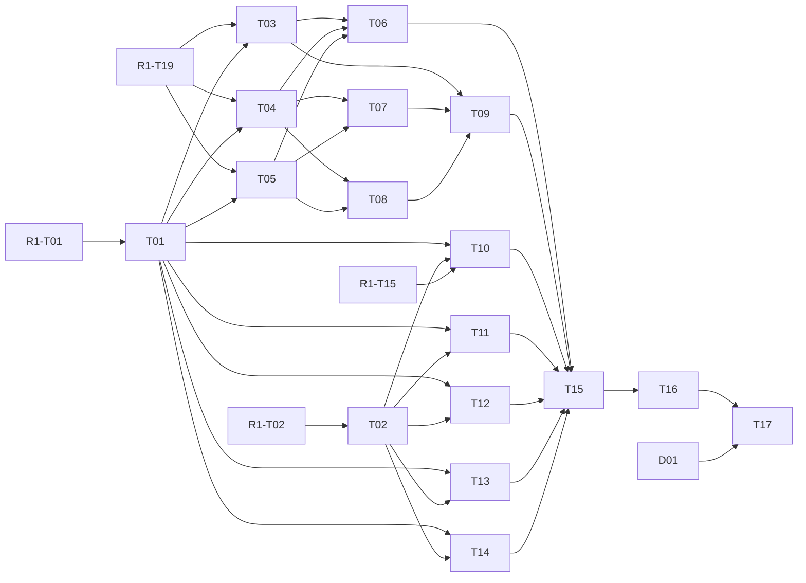

# Chronicle 第二轮：连续历史阅读、侧边时间轴与事件导航

父协调 Issue [#549](https://github.com/6spot/Loom/issues/549)，总讨论 [#547](https://github.com/6spot/Loom/issues/547)。本轮负责连续阅读、来源感知叙事时间、事件导航和当前片段上下文；第三轮 #550 仍是独立阶段。

## 已固定的结果

- 同一上传 revision 的完整章按原叙事顺序连续阅读；侧边轴按叙事时间分组。跨来源通过已确认事件明确切换并可返回，不在前端按年份拆散/混编正文。
- 0.2 整章联合产物补齐译文事件 span、主叙事/回溯区分、当前片段人物地点。读取时只消费已经校验发布的数据。
- 公开正文/轴/事件导航固定内容版本和探索 catalog，旧引用不跳新版；Event/Entity 详情也支持同一可选快照。
- 人物的本段事件角色有来源，长期官职/阵营/关系有效期仍归第三轮；地图、Why、问答、模拟不加入本轮。

语义归 [continuous-reading.md](../../../../apps/chronicle/docs/continuous-reading.md)，布局/恢复/验收归 [reading-experience.md](../../../../apps/chronicle/docs/reading-experience.md)。遵循 Amendment 0006/0007 及当前仓库开发流程。

## 任务图

表中依赖描述设计顺序和接口前置。

| Task | Issue | Depends on | 交付 |
| --- | --- | --- | --- |
| [D01](D01-background-art-skill.md) | [#588](https://github.com/6spot/Loom/issues/588) | 无 | 历史背景图技能、候选归档检索与人工背景设计 |
| [T01](T01-reading-contract.md) | [#570](https://github.com/6spot/Loom/issues/570) | R1-T01 | 阅读注解、叙事时间与导航 DTO 契约 |
| [T02](T02-reading-cases-harness.md) | [#571](https://github.com/6spot/Loom/issues/571) | R1-T02 | 真实阅读样例与独立组件浏览器基座 |
| [T03](T03-reading-generation.md) | [#572](https://github.com/6spot/Loom/issues/572) | T01, R1-T19 | 完整章联合生成阅读注解并接入 provider |
| [T04](T04-reading-compiler.md) | [#573](https://github.com/6spot/Loom/issues/573) | T01, R1-T19 | 阅读注解 remap、时间分组和不可变投影编译 |
| [T05](T05-reading-store.md) | [#574](https://github.com/6spot/Loom/issues/574) | T01, R1-T19 | 阅读 stream、区段和事件位置的持久化 |
| [T06](T06-reading-publication.md) | [#575](https://github.com/6spot/Loom/issues/575) | T03, T04, T05 | 把阅读索引接入唯一 worker 和原子发布事务 |
| [T07](T07-reading-stream-api.md) | [#576](https://github.com/6spot/Loom/issues/576) | T04, T05 | 连续正文分页、侧轴区段与精确 locate 查询 |
| [T08](T08-reading-event-api.md) | [#577](https://github.com/6spot/Loom/issues/577) | T04, T05 | 固定快照的事件预览与跨来源正文位置反查 |
| [T09](T09-reading-http-client.md) | [#578](https://github.com/6spot/Loom/issues/578) | T03, T07, T08 | 统一接入 Python/Rust 公开路由和 typed 阅读 client |
| [T10](T10-reading-content-window.md) | [#579](https://github.com/6spot/Loom/issues/579) | T01, T02, R1-T15 | 连续白话正文窗口与按需原文组件 |
| [T11](T11-reading-time-axis.md) | [#580](https://github.com/6spot/Loom/issues/580) | T01, T02 | 按叙事时间分组的侧边轴与窄屏时间入口 |
| [T12](T12-reading-position.md) | [#581](https://github.com/6spot/Loom/issues/581) | T01, T02 | 当前片段、深链接、返回栈与滚动恢复控制器 |
| [T13](T13-reading-event-preview.md) | [#582](https://github.com/6spot/Loom/issues/582) | T01, T02 | 正文事件词预览、触屏入口与目标选择组件 |
| [T14](T14-reading-context.md) | [#583](https://github.com/6spot/Loom/issues/583) | T01, T02 | 当前正文人物、地点及有来源的事件角色组件 |
| [T15](T15-reading-page-integration.md) | [#584](https://github.com/6spot/Loom/issues/584) | T06, T09, T10, T11, T12, T13, T14 | 统一接入连续阅读页面、事件入口与生产构建 |
| [T16](T16-reading-automated-gate.md) | [#585](https://github.com/6spot/Loom/issues/585) | T15 | 离线整链、浏览器交互与长文性能验收接入 CI |
| [T17](T17-reading-live-acceptance.md) | [#586](https://github.com/6spot/Loom/issues/586) | T16, D01 | 真实章节阅读、事件定位与第二轮独立验收 |

跨轮入口：R1-T01 = [#551](https://github.com/6spot/Loom/issues/551)，R1-T02 = [#552](https://github.com/6spot/Loom/issues/552)，R1-T15 = [#565](https://github.com/6spot/Loom/issues/565)，R1-T19 = [#569](https://github.com/6spot/Loom/issues/569)。

## 并行与文件所有权

并行实现同时遵守任务依赖和实际文件边界，避免多个任务同时修改同一共享入口。

- 新 0.2 schemas、`reading_contract.py`、`reading-types.ts`、c2r2-contract fixtures：T01。
- corpus/second-round 样例、Vite 基座、reading-component-smoke：T02。
- 生成/provider 接线：T03。
- 投影编译：T04。
- reading store：T05。
- worker/publication 接线：T06。
- stream/event API：T07/T08。
- HTTP/client 接线：T09。
- Reader 独立组件：T10–T14，最终统一挂接由 T15。
- 离线/浏览器/CI gate：T16。
- 真实内容验收：T17。

如果实现需要越过既定文件边界，先协调交接；不要为了并行制造第二套入口。

## 背景图设计准备

[background-art.md](../../../../apps/chronicle/docs/background-art.md) 只定义页面背景候选与人工确认流程。D01 不等于完整产品背景功能，不自动获得上传/保存/页面展示权限。

## 交付

每个 Leaf 以对应 Issue、实现、验证和 PR 交付。任务文档按需要保存有价值的设计说明和验证证据。

仓库交付完成规则见 [`../../../development/task-completion.md`](../../../development/task-completion.md)。
