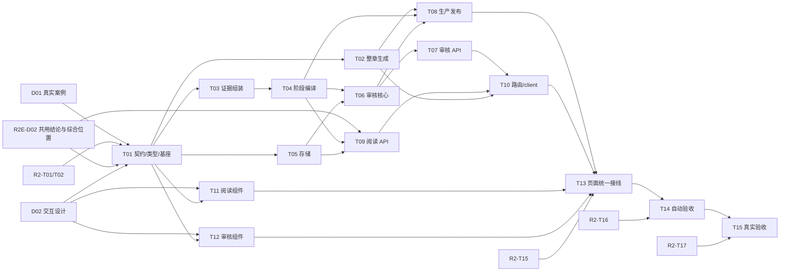

# Chronicle 第三轮：人物身份与关系随阅读阶段变化

2026-09-12 范围调整：[C2-R2E 增强阶段](../reading-enhancement/README.md) / [#658](https://github.com/6spot/Loom/issues/658) 直接实现多史料核对、两次审核、综合正文和紧凑状态。其 [#659](https://github.com/6spot/Loom/issues/659) 固定真实案例，[#660](https://github.com/6spot/Loom/issues/660) 固定共用合同。本轮消费已审核结论和 `{version, paragraph_id, phase_id}`，扩展有据任期算法及独立人物页。

下方 17 项保留原模块划分。每份本地任务说明保留目标、输入输出、文件归属、具体实施步骤与验收要求，可从本目录直接阅读；对应 GitHub Issue 记录同一任务的需求与验收上下文。任务状态由当前任务工具维护。

来源 0.3 候选仍是任期推理输入，不能直接充当综合正文或最终历史结论。共享契约具备后可启动相应独立模块；最终接线／验收依赖真实综合正文及读取接口，不给所有任务增加整个增强轮完成的笼统前置。

父协调 Issue [#550](https://github.com/6spot/Loom/issues/550)，总规划 [#547](https://github.com/6spot/Loom/issues/547)。本轮拆为 **2项准备任务＋15项实现/验收任务**。此索引记录需求、输入、文件归属与验收顺序；任务状态由当前任务管理工具维护。

产品语义以 [person-state-reading.md](../../../../apps/chronicle/docs/person-state-reading.md) 为准。下列任务负责 R2E 共用链路之外的专门任期推理与人物页；不能把已交付的紧凑状态侧栏当作完整 R3。

## 已收敛的范围

- 官职、爵号和明确的效力/归附关系，按有原文支持的叙事阶段显示，稳定人物身份不随头衔改变。
- 每项分别有“明确/不明确”标记；弱化项保持可读可查，不凭confidence染色，不把未知、未来、结束和没有材料混为一谈。
- 默认侧栏只列当时身份及地点状态；行动、角色与身份变化进入人物详情。内部阶段精确到状态变化，前台入口只挑重要事件／时期。
- 在同一完整章0.3联合产物中抽取，按章集中核对阶段依据，发布前编译，阅读消费固定版本。
- 沿用 HistoryPage、移动入口、唯一 controller 和既有原文阅读器；人物页提供介绍和有据经历时间轴，不要求穷尽生平。背景图产品、长期联盟、亲缘图谱保持各自后续范围。

## 任务图

表中依赖是具体输入、接口和文件交接。跨轮接口与验收依赖保留，设计准备可先启动。

| Task | Issue | 前置 | 交付 |
| --- | --- | --- | --- |
| [D01](D01-person-state-cases.md) | [#617](https://github.com/6spot/Loom/issues/617) | [C2-R1-T02](https://github.com/6spot/Loom/issues/552) | 真实人物变化链与阶段反例语料 |
| [D02](D02-person-state-interaction-design.md) | [#618](https://github.com/6spot/Loom/issues/618) | 无 | 正式组件中的紧凑状态、独立人物页及依据审核交互场景 |
| [T01](T01-person-state-contract.md) | [#619](https://github.com/6spot/Loom/issues/619) | [C2-R3-D01](https://github.com/6spot/Loom/issues/617)、[C2-R3-D02](https://github.com/6spot/Loom/issues/618)、[C2-R2-T01](https://github.com/6spot/Loom/issues/570)、[C2-R2-T02](https://github.com/6spot/Loom/issues/571)、[C2-R2E-D02](https://github.com/6spot/Loom/issues/660) | 0.3 来源阶段 schema、共用结论及综合位置扩展、共享类型 |
| [T02](T02-person-state-generation.md) | [#620](https://github.com/6spot/Loom/issues/620) | [C2-R3-T01](https://github.com/6spot/Loom/issues/619)、[C2-R2-T03](https://github.com/6spot/Loom/issues/572) | 完整章联合生成阶段事实并接入现有 provider |
| [T03](T03-person-state-assembly.md) | [#621](https://github.com/6spot/Loom/issues/621) | [C2-R3-T01](https://github.com/6spot/Loom/issues/619)、[C2-R2-T04](https://github.com/6spot/Loom/issues/573) | 跨章阶段依据 remap 与不可变证据组装 |
| [T04](T04-person-state-projection.md) | [#622](https://github.com/6spot/Loom/issues/622) | [C2-R3-T03](https://github.com/6spot/Loom/issues/621) | 按叙事阶段编译身份、变化与两档明确性 |
| [T05](T05-person-state-store.md) | [#623](https://github.com/6spot/Loom/issues/623) | [C2-R3-T01](https://github.com/6spot/Loom/issues/619)、[C2-R2-T05](https://github.com/6spot/Loom/issues/574) | 阶段评估、人物投影与快照分歧索引持久化 |
| [T06](T06-person-state-review-core.md) | [#624](https://github.com/6spot/Loom/issues/624) | [C2-R3-T04](https://github.com/6spot/Loom/issues/622)、[C2-R3-T05](https://github.com/6spot/Loom/issues/623)、[C2-R1-T08](https://github.com/6spot/Loom/issues/558) | 按章冻结阶段依据审核与评估产物 |
| [T07](T07-person-state-review-api.md) | [#625](https://github.com/6spot/Loom/issues/625) | [C2-R3-T06](https://github.com/6spot/Loom/issues/624)、[C2-R1-T09](https://github.com/6spot/Loom/issues/559)、[C2-R1-T10](https://github.com/6spot/Loom/issues/560) | 混合审核队列、阶段依据详情与原文 API |
| [T08](T08-person-state-publication.md) | [#626](https://github.com/6spot/Loom/issues/626) | [C2-R3-T02](https://github.com/6spot/Loom/issues/620)、[C2-R3-T04](https://github.com/6spot/Loom/issues/622)、[C2-R3-T06](https://github.com/6spot/Loom/issues/624)、[C2-R2-T06](https://github.com/6spot/Loom/issues/575) | 将阶段审核与人物投影接入唯一生产发布事务 |
| [T09](T09-person-state-read-api.md) | [#627](https://github.com/6spot/Loom/issues/627) | [C2-R3-T04](https://github.com/6spot/Loom/issues/622)、[C2-R3-T05](https://github.com/6spot/Loom/issues/623)、[C2-R2-T07](https://github.com/6spot/Loom/issues/576)、[C2-R2-T08](https://github.com/6spot/Loom/issues/577)、[C2-R2E-D02](https://github.com/6spot/Loom/issues/660) | 固定综合版本的人物、地点状态及依据查询，来源 unit 分支保持独立含义 |
| [T10](T10-person-state-http-client.md) | [#628](https://github.com/6spot/Loom/issues/628) | [C2-R3-T07](https://github.com/6spot/Loom/issues/625)、[C2-R3-T09](https://github.com/6spot/Loom/issues/627)、[C2-R3-T02](https://github.com/6spot/Loom/issues/620)、[C2-R2-T09](https://github.com/6spot/Loom/issues/578) | 统一接入阶段 API、Rust 边界与 typed client |
| [T11](T11-person-state-reader-components.md) | [#629](https://github.com/6spot/Loom/issues/629) | [C2-R3-T01](https://github.com/6spot/Loom/issues/619)、[C2-R3-D02](https://github.com/6spot/Loom/issues/618)、[C2-R2-T14](https://github.com/6spot/Loom/issues/583) | 紧凑人物／地点状态及人物详情时间轴组件，逐项明确性标记 |
| [T12](T12-person-state-review-components.md) | [#630](https://github.com/6spot/Loom/issues/630) | [C2-R3-T01](https://github.com/6spot/Loom/issues/619)、[C2-R3-D02](https://github.com/6spot/Loom/issues/618)、[C2-R1-T11](https://github.com/6spot/Loom/issues/561)、[C2-R1-T12](https://github.com/6spot/Loom/issues/562) | 按章阶段依据审核表单与连续操作组件 |
| [T13](T13-person-state-page-integration.md) | [#631](https://github.com/6spot/Loom/issues/631) | [C2-R3-T08](https://github.com/6spot/Loom/issues/626)、[C2-R3-T10](https://github.com/6spot/Loom/issues/628)、[C2-R3-T11](https://github.com/6spot/Loom/issues/629)、[C2-R3-T12](https://github.com/6spot/Loom/issues/630)、[C2-R2-T15](https://github.com/6spot/Loom/issues/584) | HistoryPage 状态联动、独立人物页及原位往返、混合审核与生产构建 |
| [T14](T14-person-state-automated-gate.md) | [#632](https://github.com/6spot/Loom/issues/632) | [C2-R3-T13](https://github.com/6spot/Loom/issues/631)、[C2-R2-T16](https://github.com/6spot/Loom/issues/585) | 阶段资料整链、审核交互与阅读性能自动验收 |
| [T15](T15-person-state-live-acceptance.md) | [#633](https://github.com/6spot/Loom/issues/633) | [C2-R3-T14](https://github.com/6spot/Loom/issues/632)、[C2-R2-T17](https://github.com/6spot/Loom/issues/586) | 真实整章人物阶段资料与阅读体验独立验收 |

图突出本轮依赖和最终接线；表格列出每项完整跨轮前置。[第一轮](../first-round/README.md)负责完整章/身份审核/引用，[第二轮](../second-round/README.md)负责阅读unit/controller/snapshot。第三轮设计或fixture通过不替代前两轮的真实内容验收。

## 开工交接核查（2026-09-12）

#661 已合并，综合正文、两次审核、精选入口与基础状态是本轮的现有输入。首批下发 #617 / #618，之后由 #619 固定共享合同，再按下表的具体依赖开放其他任务。

- #619 必须固定“来源阶段证据／推理结果 → 综合事实核对输入 → 已审核结论 → 综合段落状态”的交接，并先同步 canonical 契约；来源 phase 与综合 phase 不靠同年、同名事件或序号关联。
- #622 提供带原始依据和评估归属的纯编译输出；#626 同时负责来源发布接线和把这些结果送入既有显式综合任务。来源依据审核不能替代综合事实及正文的两次审核。
- #625 / #628 / #631 扩展混合审核时保留现有 `narrative` 的 facts/prose 项、决定表单和草稿。#619 先明确队列默认范围及 `all` 的含义；不得因只加入 person_state 而使现有综合审核消失。
- #632 / #633 的完成条件包含正式 HistoryPage、独立人物页及原位返回，记录 `version/paragraph_id/phase_id`。只跑通来源章节、ReadingPage 或 stream/unit 不算第三轮整链验收。

以上补充落实既有 [source-corroboration.md](https://github.com/6spot/Loom/blob/main/apps/chronicle/docs/source-corroboration.md) 与人物阶段资料合同，不另建事实权威或发布链；各叶 Issue 的实施步骤已补充对应交接。

## 并行批次与可评阅节点

1. **先交真实案例和页面设计：D01、D02可并行。** 现有古文足够，D02用已提交原文核对点和标明synthetic的交互数据开始，不等待补传材料。
2. **T01固定机器接口。** 消费D01和R2契约/基座，统一schema、类型、审核键及浏览器suite。评阅点是16案的期望、四种宽度和两档/过程/分歧效果。
3. **按文件并行实现。** T02生成、T03组装、T05存储，以及具备各自前置的T11/T12组件互不抢文件。T04接T03完成阶段算法；T06接T04/T05完成依据审核。
4. **服务层分开交付。** T07审核API、T08生产发布、T09阅读API在各自前置具备后可并行；T10统一外层路由/client。该节点独立核对API、审核决定与发布原子性。
5. **统一接线与独立验收。** T13单独接生产页面及dist；T14验证整链/浏览器/性能和CI；T15用真实模型和完整章逐案验收。

并行按写入文件和接口组织，不要求每项单独开分支。同一工作区的Git索引/提交/推送、依赖安装、build和dist写入串行安排。准备/纯组件与最终生产接线有不同验收边界，不能把fixture展示当成真实后端通过。

## 文件所有权

| 文件/入口 | 本轮所有者与交接 |
| --- | --- |
| third-round/cases 与只读定位检查 | D01 |
| 正式人物组件的桌面／窄屏场景及交互矩阵 | D02 |
| 新0.3 schemas、person_state_contract.py、person-state-types.ts、人物契约对应条款、共享browser suite注册 | T01；先同步综合输入与审核范围，后续模块消费同一契约 |
| chapter_contract版本注册、prompt/extraction/provider/fixture_model | T02；R2-T03之后接手 |
| assembly.py 与 person_state_assembly.py | T03；R2-T04之后接手 |
| person_state_projection.py | T04；审核/发布/API共用 |
| 0009迁移与 person_state_store.py | T05；外层事务由T08持有 |
| person_state_review.py | T06；不改身份合并规则 |
| studio_person_states.py 与 studio_reviews领域队列 | T07 |
| chapter_stage/resolve_publish/chapter_store、narrative_stage/narrative_store及共用输入适配 | T08；来源发布及现有显式综合任务的生产接线；共享合同由T01先固定 |
| reading_people.py | T09；使用T05查询接口 |
| 顶层router、Rust API、typed clients、source 0.3适配 | T10 |
| 阅读人物组件/局部CSS/自己的scene与spec | T11；ReadingContextPanel从R2-T14接手 |
| 阶段审核组件/局部CSS/自己的scene与spec | T12 |
| HistoryPage/EntityPage/来源ReadingPage/Studio页、查询hook、App/SPA/build/dist | T13；server app.rs从T10顺序接手 |
| CI、gate_runtime、第三轮整链和person-state-acceptance运行指南 | T14；从R2-T16接手共享生命周期/CI |
| 真实运行报告与验收结果索引 | T15；person-state-acceptance.md在T14之后接手 |

两个跨任务共享文件已有明确串行依赖：T10→T13的server app.rs，T14→T15的验收指南。其余任务如果发现需要修改另一owner文件，协调一次明确交接，不复制第二套实现来绕过依赖。

## 固定交接接口

| 提供方 | 消费方与交付边界 |
| --- | --- |
| D01 | T01/T15：case_id、真实/合成、source hash/selector、人物/阶段/显示预期/禁止结果 |
| T01 | 各模块：0.3 schema、Python/TS DTO、评估候选键、状态键、cursor/大小/排序与browser fixture协议 |
| T03 | T04/T06/T08：同一revision ref map及保留原章归属的evidence manifest |
| T04 | T06/T08：compile_person_state_projection及带原文／评估归属的综合核对输入；T08/T09：已编译来源状态和catalog分歧索引 |
| T05 | T06/T08：不可变评估/manifest/index写入；T09：list_unit_people/list_unit_person_states/list_state_item_evidence |
| T06 | T07/T08：build/open/resolve/collect阶段依据审核接口；不承担身份合并 |
| T08 | 既有显式综合任务：冻结来源阶段依据，facts/prose两次审核后发布同版本正文／状态／引用；不以来源审核替代综合审核 |
| T07/T09 | T10：领域dispatcher和错误/分页合同，不直接挂顶层HTTP |
| T10 | T13：getReadingPeople/getPersonStates/getPersonStateEvidence/submitPersonStateAssessment与review_scope |
| T11/T12 | T13：受控props和来源/事件/提交回调；组件不拥有全局历史或审核状态 |
| T13 | T14/T15：同locator的实际页面、生产dist与普通Studio上传/审核/发布路径 |

## 轮次验收

- [ ] 首批类型/阶段/明确性契约有机器校验与真实/合成反例。
- [ ] 整章0.3生产保留完整译文、指代、事件/Claim、阶段依据与原文归属。
- [ ] 同年不同阶段、兼任、针对性结束/再次任职、未知任期/空态和来源分歧正确。
- [ ] 按章依据审核完整可追溯，身份决定与状态评估不互相替代。
- [ ] 公开读取和阅读联动固定同一版本，回读/刷新/返回不泄漏未来或旧请求。
- [ ] 两档标记、来源、触屏/键盘及长页连续审核达到设计与可操作性要求。
- [ ] 自动真实栈门、适用CI与真实provider逐案内容/体验验收分别留下结果。

## 交付

各leaf由自己的Issue说明目标/步骤，canonical合同拥有语义，task说明保留范围/前置/文件/验收。按[当前仓库流程](../../../development/task-completion.md)交付实现、验证、review与PR。父Issue保持阶段协调用途，任务状态以当前任务管理工具为准。
